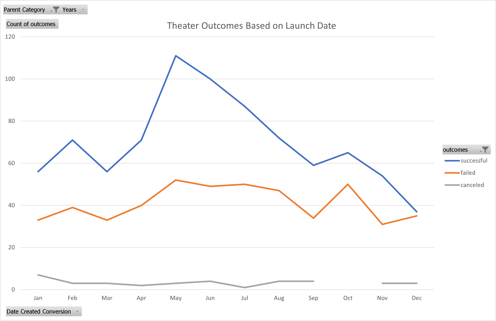
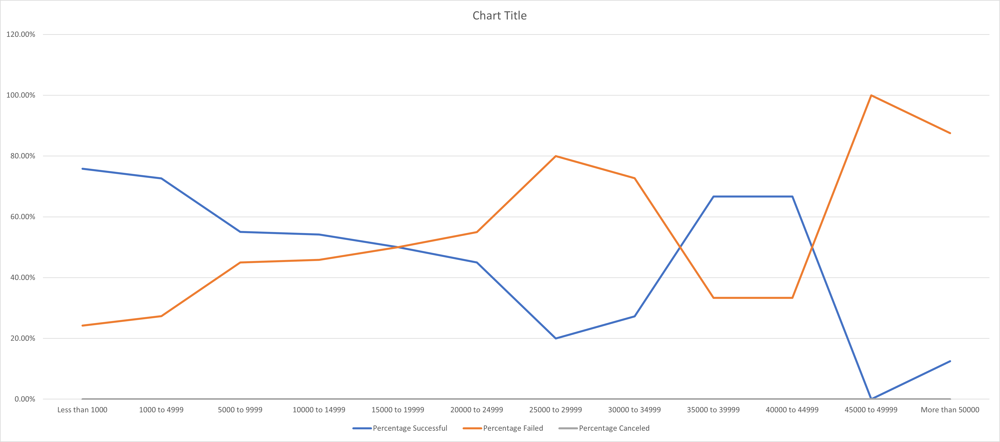

# Kickstarting with Excel

## Overview of Project

### Purpose
	On the data of Kickstarter projects from 2009 to 2017, analysis was done to determine and observe the
likelihood of a play getting fully funded. The two vectors of observation that this study goes over
are the launch date of the project and their monetary goals. These results can server to give an optimal
time to start a project and convey the likelihood of success depending on the scope of the goal.

## Analysis and Challenges

### Analysis of Outcomes Based on Launch Date
	By creating a pivot table of the outcomes of campaigns against their month of launch, the attached graph was
created. By filtering out the target campaigns (theater), it can be seen that while the number of campaigns 
that fail to reach their goals remain static over the year, the number of successful campaigns drastically
goes up during May, with a gradual decline in success until next May. Campaigns started during the holidays
seem to be both few in number and low in success.

### Analysis of Outcomes Based on Goals
	By charting out "plays" campaigns based on their funding goals, the graph shown below can be created. Contrary
to the entire theater category, there were no cancelled play projects. With the projects graphed based on the
percentage chance of their success, the correlation of goal to success is not clear. The clearest takeaways are
that plays that have low-ambition goals tend to do better consistently than high-value productions, and plays
that aim for >$50000 goals are nearly always failures.

### Challenges and Difficulties Encountered
	The biggest issue with being able to provice a ocncrete analysis of kickstarter plays is the small data set.
While observing outcomes vs launch date the data set is enough to draw conclusions from, the second analysis
suffers from having too few campaigns at the upper goal amounts to draw conclusions from. In addition to this,
the requested format of a line graph based on percentage of campaigns completed turned out to not be optimal to
display the data. Since all play campaigns were either successful or cancelled, the graph needed to show a context
for how many campaigns were done in total for any given goal bracket. Unfortunately, the graph currently seems to 
indicate that the $35000-50000 goal point has the highest chance of success, while failing to note that only 6
campaings were attempted. 

## Results
	The beginning of summer in May sees the highest success in creating new theater kickstarter campaigns, and these
campaigns receive proper funding if started during the summer months. However, it would be unwise to start campaigns
in the winter months, as these campaigns tend to not receive the initial backing they need to eventually see their
goals reached. When choosing a monetary scope for play projects, asking for lower (<$10000) amounts of money tends to
result in comparative success, while asking for high (>$50000) goals is a surefire way to lead a project to failure.
	The dataset unfortunately suffers from a lack of data points, as seen in the higher end of outcomes graphed
against goals. The single-digit number of campaigns leads these data points to be nearly useless. A way to make this
data be more comprehensible would be to either use a bar graph to display this information, or overlay another data
line onto the graph to show the total number of campaigns at each goal level. Doing this would give context to the 
percentages presented by the graph.

- What are two conclusions you can draw about the Outcomes based on Launch Date?

- What can you conclude about the Outcomes based on Goals?

- What are some limitations of this dataset?

- What are some other possible tables and/or graphs that we could create?
